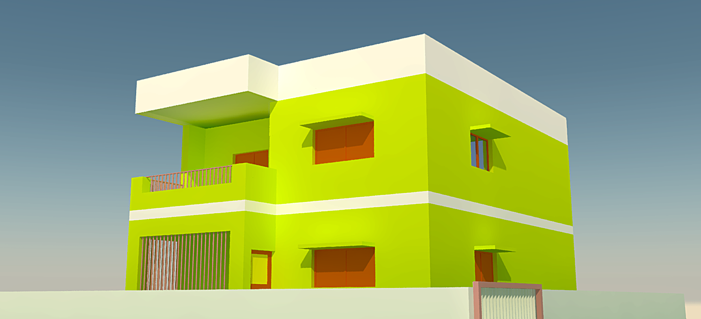
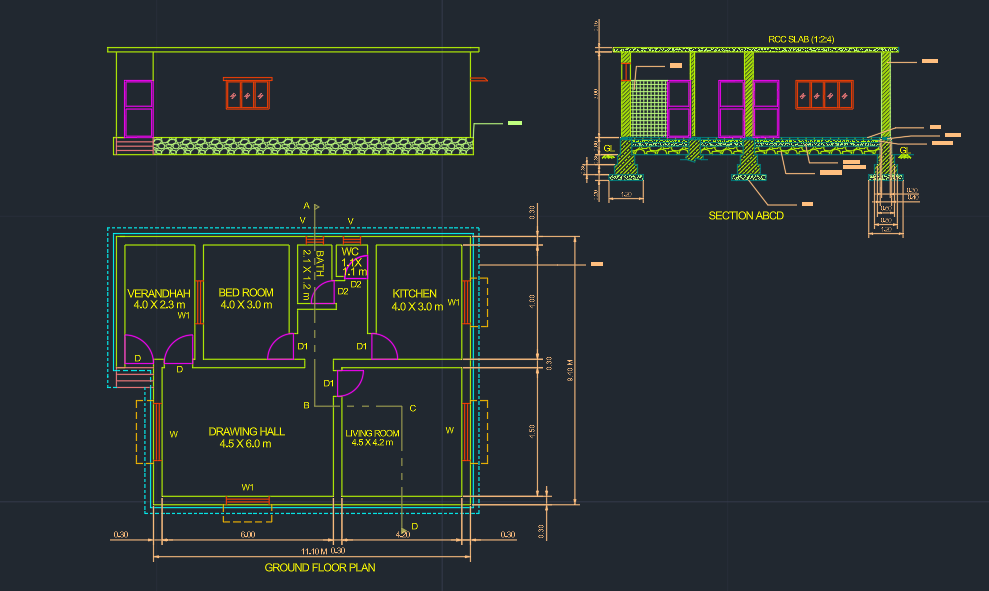

# 🏠 House Design in AutoCAD

Welcome to this simple yet modern **two-storey house design** created using AutoCAD. This project includes both 2D plans and a 3D model with a vibrant color scheme and functional layout, ideal for small residential plots.

---

## 📸 3D View (Render)

This image shows the front elevation with:
- Flat roof design
- Balcony with railing
- Modern rectangular geometry
- Bright green and white exterior

---

## 📐 2D Floor Plan

Included:
- Ground & first floor layouts
- Wall sections
- Door/window placements
- Stairs and balcony

---

## ✨ Features

- 🏡 **Two-storey modern home**
- 🧱 Clear zoning for public and private spaces
- ☀️ Shaded windows for passive cooling
- 🧭 Optimized layout for small plots
- 🛠️ Built entirely in **AutoCAD**
- 📂 Includes `.dwg` files for 2D and 3D views

---

## 🙏 Thank You!

Thanks for checking out this project!  
Feel free to ⭐ star the repository or fork it if you'd like to build on it.

---
